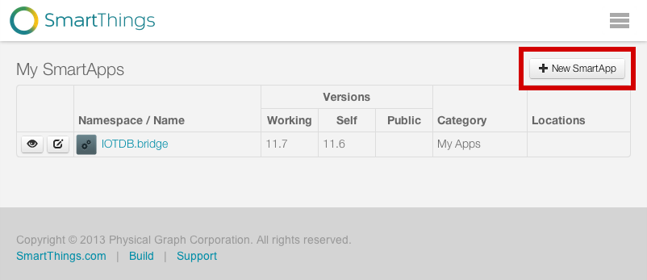
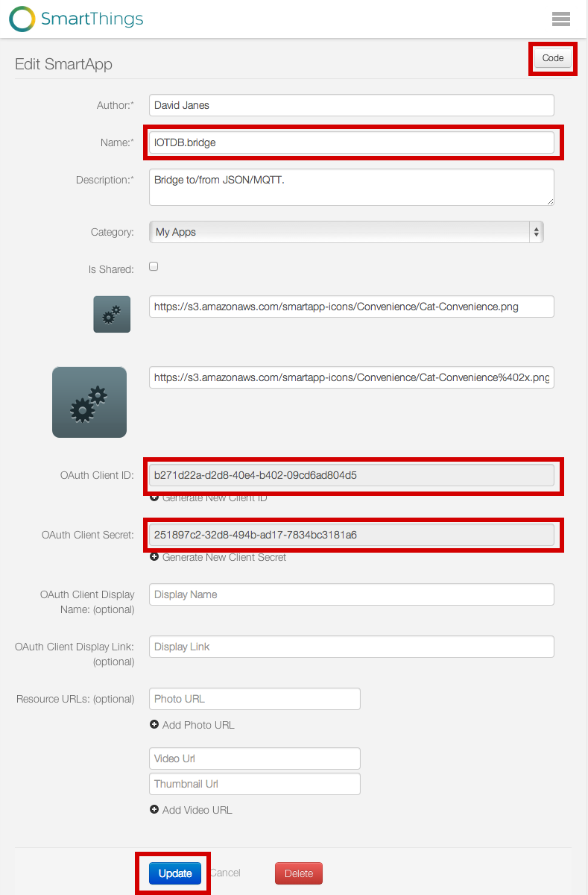
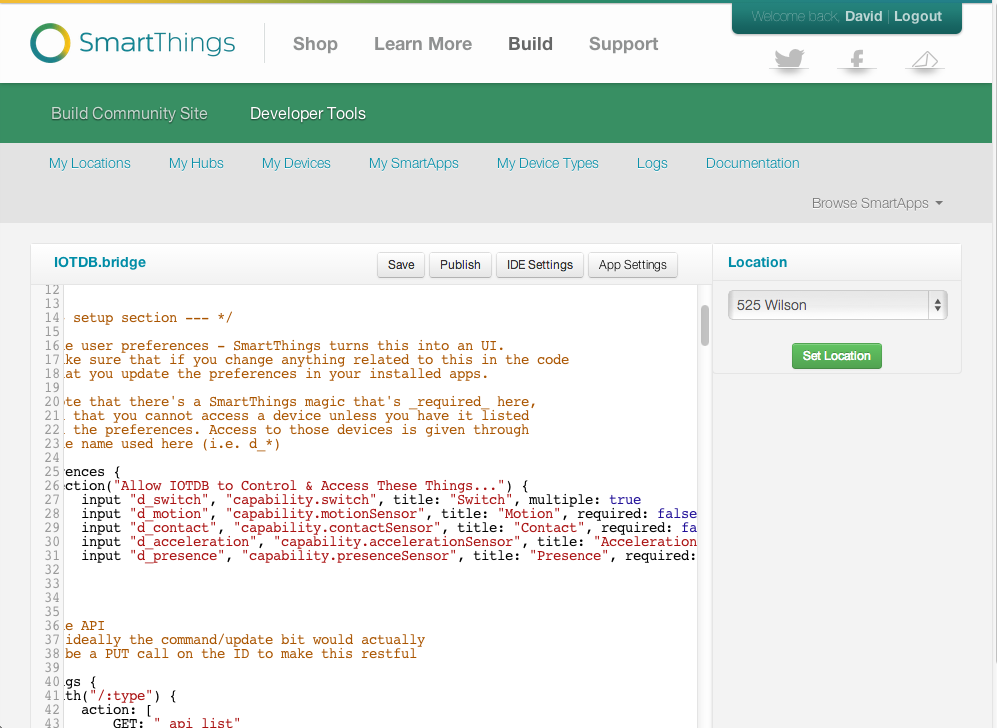

iotdb-smartthings
=================

Code to:

* Demo how to write SmartThings API
* Control / Monitor SmartThings from Python
* Control / Monitor SmartThings from Node-JS
* Broadcast SmartThings events to MQTT

## Installation

### Copy this project from GitHub onto a local directory

### Log into SmartThings

https://graph.api.smartthings.com/

If necessary, do what it takes to become a Developer

### Create New App

Go to:

https://graph.api.smartthings.com/ide/apps

Click on "+ New SmartApp"

### Fill in the App Details

Make sure to "Enable OAuth" and to copy the two values produced. You'll need them them later. Press the *Create* button. Authorize access to as much as your comfortable with, you can always change this later from your iPhone or Android app.

### Add the code

* Press the *Code* button
* Copy the code from <code>smartthings.groovy</code> and paste
* Press *Save*
* Press *Publish*

